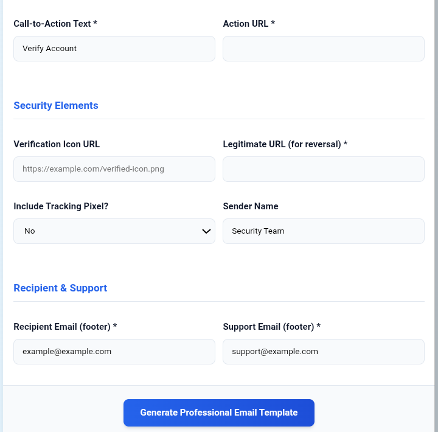

# ThreatMail-Simulator

ThreatMail-Simulator is a Python-based toolkit for simulating and automating the generation and sending of emails. It is aimed at security professionals, penetration testers, and researchers who want to create, launch, and manage email-based simulation tools. The suite provides a menu-driven interface for running a curated set of scripts, making it suitable for tasks like phishing awareness training or testing email defenses.

---

## Preview

Below are example screenshots of ThreatMail-Simulator in action:

<p align="center">
  
  <br>
  
  <br>
  
  <br>
  
</p>

---

## Table of Contents

- [Features](#features)
- [Architecture Overview](#architecture-overview)
- [Quick Start](#quick-start)
- [Email Sending Example](#email-sending-example)
- [Extending the Suite](#extending-the-suite)
- [Directory Structure](#directory-structure)
- [License & Credits](#license--credits)

---

## Features

- **Menu-driven Tool Suite:** Launch all registered scripts from a single interactive menu.
- **Human-friendly Names:** Setup script assigns readable names to tools for a clean user experience.
- **HTML Email Automation:** Example script for sending HTML emails via SMTP.
- **Template Management:** Store and reuse HTML email templates in `mails/`.
- **Easy to Extend:** Add scripts into `scripts/` and register them via setup.

---

## Architecture Overview

- **main.py**: Entry point. Reads `.names.json`, lists registered scripts, and launches selected scripts.
- **setup.sh**: Setup utility for registering scripts with friendly names.
- **scripts/**: Folder for Python, Bash, or other executable scripts, accessible via the launcher.
- **mails/**: Stores HTML email templates.
- **images/**: Optional, for template or documentation images.

**Usage Flow:**
1. Run `setup.sh` to assign display names to scripts.
2. Launch `main.py` to use the interactive menu.
3. Select and run tools as needed.

---

## Quick Start

### 1. Clone the Repository

```bash
git clone https://github.com/zerosocialcode/ThreatMail-Simulator.git
cd ThreatMail-Simulator
```

### 2. Register Scripts

Assign display names to menu scripts:

```bash
bash setup.sh
```

This creates `.names.json` mapping scripts to display names.

### 3. Configure Email Scripts

Edit scripts like `scripts/main.py`:

```python
SMTP_SERVER = 'smtp.gmail.com'
SMTP_PORT = 587
SENDER_EMAIL = 'your_email@gmail.com'
SENDER_PASSWORD = 'your_app_password'
```
> For Gmail, use an App Password if 2FA is enabled.

### 4. Prepare Email Templates

Place HTML files in `mails/`. Each is selectable as a template.

### 5. Launch the Suite

```bash
python3 main.py
```

---

## Email Sending Example

The provided email sender script (`scripts/main.py`):

- Prompts for recipient address and subject.
- Lists available HTML templates.
- Sends email using selected template and SMTP credentials.

---

## Extending the Suite

1. Add your script to `scripts/`.
2. Run `bash setup.sh` to assign a display name.
3. The script appears in the menu.

---

## Directory Structure

```
ThreatMail-Simulator/
├── images/            # Optional: images for docs or email templates
├── mails/             # HTML email templates
├── scripts/           # Python, Bash, or other scripts
│   ├── emailgen.py    # (Example) Email generator
│   └── main.py        # (Example) HTML email sender
├── main.py            # Entry point: launcher/menu
├── setup.sh           # Setup utility
├── .names.json        # (Auto-generated) Script display names
```

---

## License & Credits

- **Author:** [zerosocialcode](https://github.com/zerosocialcode)
- **License:** MIT

---

Pull requests and feature suggestions are welcome.